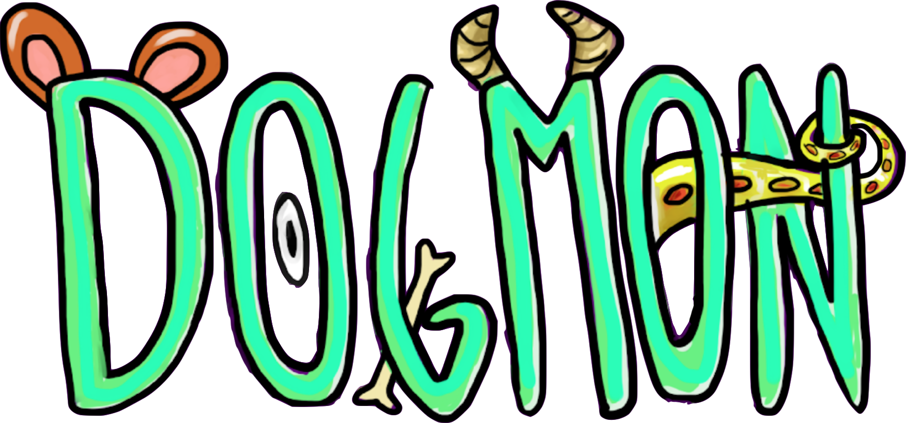

<head>
	<h1>Dogmon</h1>
</head>
<body>
	

  

  ##  Description:
   - The Dogmon is a fun way to turn your photos into "dogmonster" versions of yourself. Using starGAN, we built a "DogMonstrifier", combining your photo with images of dogs and generating completely absurd and surprising results. Try it now and see what kind of monster you can become.

  ##  Running:
   - Clone code - "git clone url_repository" .
   - Running "yarn" in path .
   - For better structuring of the code used, Eslint, Editor config and Prettier installation of plugins in Vscode.

   - run "yarn dev:server" in terminal.

</body>
